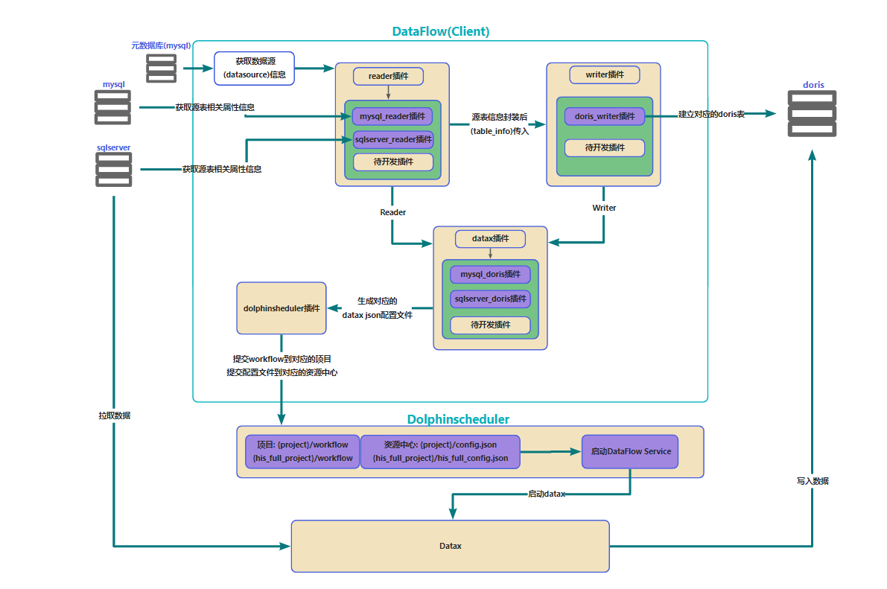

# DataFlow
## 一.简介
dataflow是用python编写的一个数据集成工具，集成datax,dolphinscheduler具有如下功能:
- 自动在目标库建表
- 自动提交数据同步调度任务到dolphinscheuler(能够同步全量历史数据,增量T+1数据)
- 动态识别数据源的变更
- 数据源读取插件易扩展
## 二.依赖环境
datax,dolphinscheduler,pydolphinscheduler
## 三.流程图
 
## 四.项目架构
      ByteFlow
          |
          |----client  生成拉取任务代码源文件
          |     |----conf 配置参数
          |     |----datax 生成datax json配置任务
          |     |----dolphinscheduler 生成dolphinscheduler工作流,并提交到dolphinscheduler
          |     |----ds 元数据库操作
          |     |----model 数据模型
          |     |----reader 获取拉取源数据库的表属性信息
          |     |----util 工具包
          |     |----writer 生成目的数据库表信息,并在目标库建立合适的表
          |     |----exec_console.py 启动client的代码文件
          |
          |----service 部署在dolphinscheduler上的脚本
          |     |----conf 配置
          |     |----ds 元数据库操作
          |     |----exec_service 启动service的代码文件, 动态获取数据源的连接信息并同步数据到目的库
          |
          |----start_client.sh 启动client的shell脚本
## 五.操作流程
- 将client和service中conf目录下的配置文件配置好
- 将service的代码放在资源中心的byte_flow目录(需要先创建)下
- 在dolphinscheduler的project中创建对应的项目来存放workflow,在资源中心创建对应的目录来存放datax的配置文件
- dolphinscheduler的服务器要安装pydolphinscheduler环境
- ./start_client.py 启动客户端
## 六.待改进的地方
- 任务配置的方式是在服务器终端配置(终端输入命令比网页一个一个点块[狗头])
## 代码协议
无任何协议,随便用,随便玩。
